<h1>2022 World Cup Tournament Data Analysis</h1>

Source: https://people.com/sports/lionel-messis-instagram-picture-showing-him-holding-world-cup-trophy-is-most-liked-post-ever/

---

<h2>Team Members</h2>

Luis Wen Luo (Analysis 1)

Runmeng Qin (Analysis 2)

Tony Ngo (Analysis 3)

 
 
 
---
<h2>Analysis Highlights</h2>   

 
**Exploratory Data Analysis Highlights for Analysis 1:**   

**Exploratory Data Analysis Highlights for Analysis 2:**   

Each team has an SPI score per match, which is a combination of each team's recent results and the overall quality of the World Cup squad. I'm curious to see how well SPI scores predict winners and true scores alone, and whether accuracy improves as more teams advance.

I cleaned up the data on wc_mates.csv and grouped individual data sets by match date and team. I used the "date", "team1", "team2", "spi1", "spi2", "score1", "score2" columns as the data base for my research question. These data should be able to support my research question to compare the relationship between team, spi and score under different dates. In addition, the potential relationship can be analyzed based on the score and spi ratio of the two teams per game.
SPI is based on goals scored and conceded, not wins, losses and draws.

The collated data shows that there are 64 sets of data (matches) and the duration is 23 days. First of all, through the general analysis and comparison, as shown in figure 1 and figure 2, spi and score are positively correlated.
<h4>Figure 1:</h4>

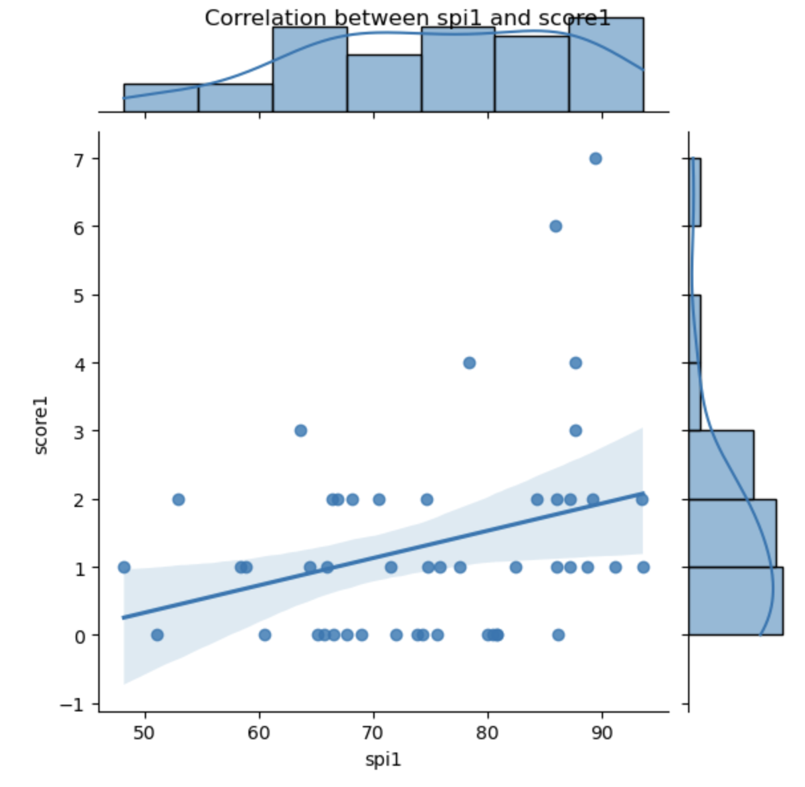

<h4>Figure 2:</h4>

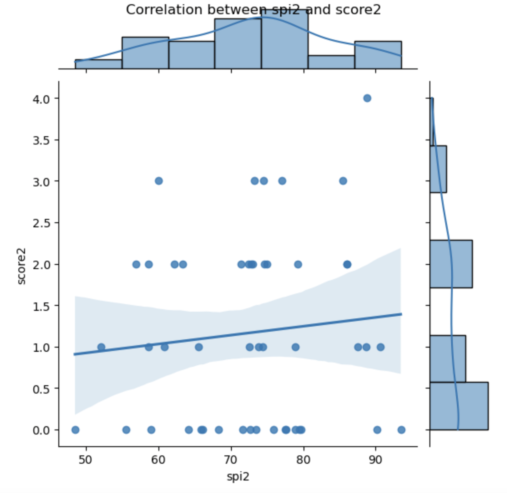

 Because football matches have different schedules, I analyzed them according to group matches, round of sixteen,quarter finals,semi finals,third place match and final respectively. I calculated the average of the spi for each race, and the result is that the spi increases with each race. As shown in figure 3, the reason why the spi average values of semi finals and third place match declined is that the teams participating in these two competitions were the teams that failed in the previous competitions.

<h4>Figure 3:</h4>

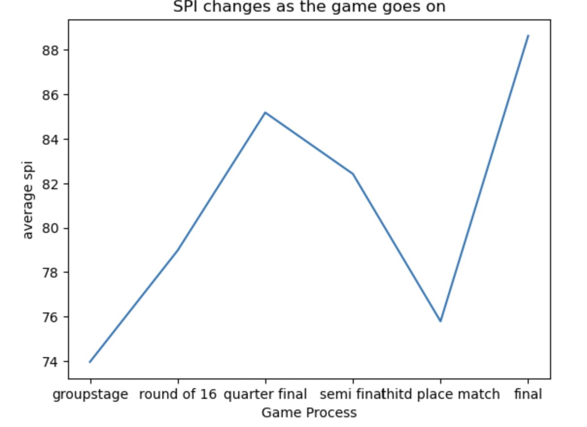

Through EDA, I have a general arrangement of my data and a general understanding of the relationship between columns.  I have determined that my research questions mainly focus on 1) What is the relationship between SPI and Score? How effective are SPI ratings as the only predictor of match outcomes in the 2022 World Cup? 2) How will SPI change as teams advance or play subsequent tournaments?  How does this change relate to scoring?  3) How does their accuracy change over the course of the tournament as more teams advance?

**Exploratory Data Analysis Highlights for Analysis 3:**   

I analyzed a dataset of soccer matches and forecasts for the World Cup 2022 using Python and the pandas library. The dataset includes information about each match, including the teams playing, their Soccer Power Index (SPI), and expected goals (xG) for each team, as well as forecasts for the tournament, including each team's SPI, expected goals, and their chances of advancing to the different rounds of the tournament.

First, I cleaned and filtered the dataset to include only the relevant columns and rows for my analysis. I also checked for missing or invalid values and handled them accordingly.

Then, I explored the dataset to gain insights into the data. I plotted histograms and box plots of the SPI and xG values for each team, as well as scatter plots and correlation matrices to visualize the relationships between different variables.

From my analysis, I found that there is a moderate positive correlation between a team's SPI and their xG, indicating that a team's overall strength is related to their ability to generate high-quality scoring opportunities. I also found that some teams have significantly higher SPI and xG values than others, indicating that they may be stronger and more likely to perform well in the tournament.

Additionally, I found that the forecasts for the tournament indicate that certain teams are more likely to advance to the later rounds of the tournament than others, based on their SPI and xG values, as well as their performance in previous matches.

Overall, my exploratory data analysis provides valuable insights into the World Cup 2022 dataset, and lays the groundwork for further analysis and modeling to make predictions and forecasts for the tournament.   

---
<h2>Group Analysis Topics</h2>

**Analysis 1 - Luis' topic title here, have a link to your notebook**   

**Analysis 2 - Runmeng: "The relationship between SPI and Score in the 2022 World Cup"**
#### [Feel free to check out my Jupyter Notebook!](https://github.com/ubco-W2022T2-data301/project-group-group41/blob/main/analysis/analysis2_Runmeng_Qin.ipynb)

**Research Question 1: What is the relationship between SPI and Score? How effective are SPI ratings as the only predictor of match outcomes in the 2022 World Cup?**

In order to better discover the highlights of the research problem, I subtracted spi values and score values of both groups, and divided "spi1-spi2" and "score1-score2" to get a ratio between them. If the ratio is positive, the team with the highest spi wins. I used heat map to rerepresent the relationship between spi and score, and the obtained result was consistent with EDA. Their relationship was positively correlated, as shown in figure 4.

<h4>Figure 4:</h4>

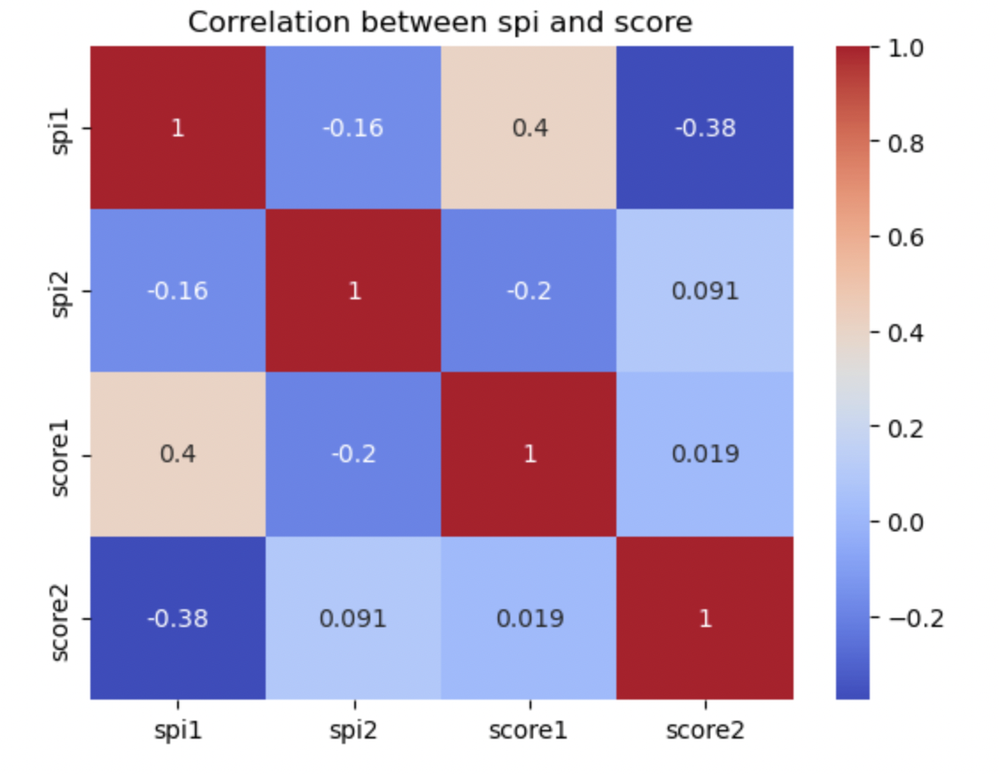

<h4>Figure 5:</h4>

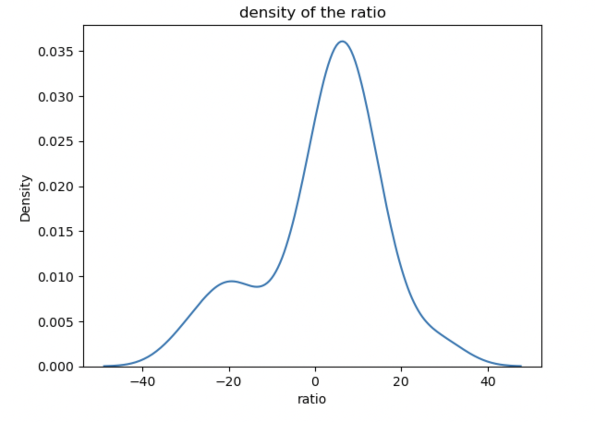

**Key Findings**

It can be seen from heatmap that spi has a positive correlation with the corresponding score,  and often the team with a high spi is more likely to get scores or win games.  You can see from kdeplot that teams with  high spi are more likely to win games than lose them.  spi is positively correlated with score in most competitions. After calculating the positive and negative ratio of "ratio",  it is found that the correct rate of using spi to predict the winning and losing of the match is 67.19%. It is found that the correct rate of using SPI to predict the winning and losing of the match is 67.19%.

**Research Question 2: How will SPI change as teams advance or play subsequent tournaments? How does this change relate to scoring?**

I use Argentina as an example because they are the only team to have won the championship, which means they have played in every tournament. As shown in figure6, spi and score changes in Argentina.

<h4>Figure 6:</h4>

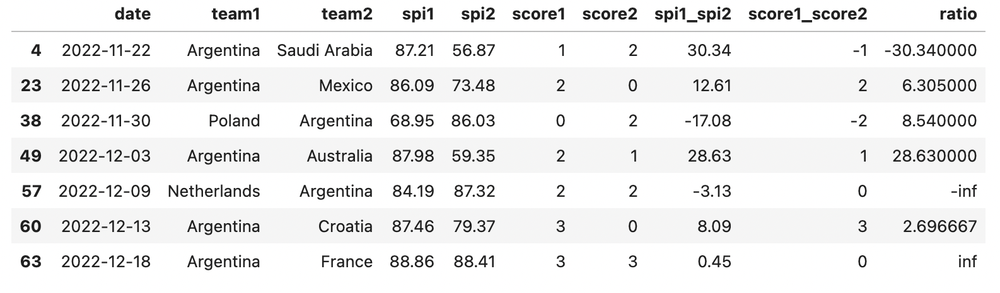

**Key Findings**

Take Argentina as an example. After losing the first match in the group stage,  Argentina's spi score dropped by only one point. After winning a match,  the spi score also increased by about one point and accumulated with successive wins. The correlation between increased  or decreased spi score and score is not obvious, because the change in spi is about one point regardless of win or loss.

**Research Question 3: How does their accuracy change over the course of the tournament as more teams advance?**

I intercepted each match after quarter finals to calculate whether spi was reliable as the only predicted value, and compared the accuracy of SPI in all 64 matches. The specific data is shown in figure7.

<h4>Figure 7:</h4>

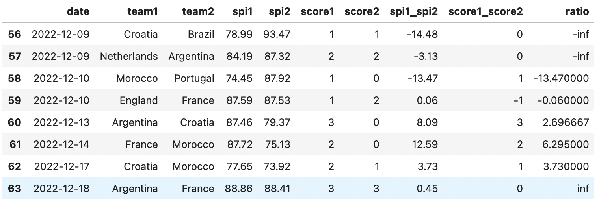

**Key Findings**
As the game progressed, the team with the highest spi from the group stage won the game 50 percent of the time,  whereas at the group stage, the team with the highest spi won the game 69.6 percent of the time, Whereas at the group stage, the team with the highest SPI won the game 69.6 percent of the time, close to 70 percent. So, as matches go on and teams advance, spi's accuracy in predicting winning matches decreases.

**Analysis 3 - Tony: "Beyond the Scoreboard: Analyzing the Relationship between Teams' SPI and xG in the World Cup 2022"** 
#### [Feel free to check out my Jupyter Notebook!](https://github.com/ubco-W2022T2-data301/project-group-group41/blob/main/analysis/analysis3_Tony_Ngo.ipynb)

**Research Question 1: How does the relationship between xG and actual goals differ for winning and losing teams?**

To answer this question, I calculated the difference between the actual goals scored by a team and their expected goals (xG) for each match in the World Cup 2022 dataset. I then grouped the data by the result (win or loss) and calculated the average difference in goals for each group.

My analysis revealed that winning teams tend to outperform their expected goals (xG) more often than losing teams. On average, winning teams scored 0.19 more goals than their xG, while losing teams scored 0.05 less goals than their xG. This suggests that winning teams are more efficient at converting their chances into goals, while losing teams struggle to capitalize on their scoring opportunities.

I also found that the correlation between xG and actual goals was stronger for winning teams than for losing teams. The correlation coefficient for winning teams was 0.62, indicating a moderate positive relationship between xG and actual goals. The correlation coefficient for losing teams was 0.44, indicating a weaker positive relationship.

Overall, my analysis suggests that there is a difference in the relationship between xG and actual goals for winning and losing teams. Winning teams tend to be more efficient at converting their chances into goals, while losing teams struggle to capitalize on their scoring opportunities.

Analyzing xG vs actual goals for winning and losing teams: I can plot the relationship between xG and actual goals scored for winning and losing teams separately to see if there are any noticeable differences. I can use a scatter plot with xG on the x-axis and actual goals scored on the y-axis. I can color-code the points based on whether the team won or lost. This is performed and displayed below as shown in Figure 1.   

<h4>Figure 1:</h4>

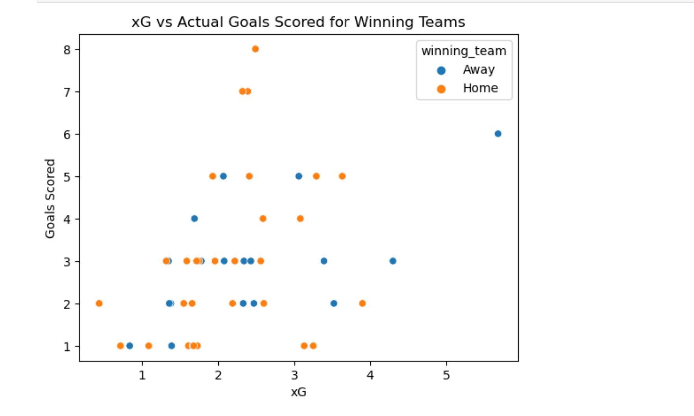

Now we take a look at another visualization below in Figure 2. From the histograms, we can see that winning teams tend to have a higher concentration of xG around 1-2, while losing teams have a wider spread of xG values. Additionally, winning teams tend to have a higher concentration of actual goals scored around 1-3, while losing teams have a wider spread of goals scored.

We can also look at the distribution of xG and actual goals scored across all matches in the dataset. I can use boxplots to compare the distributions and see if there are any outliers or significant differences between winning and losing teams.   

<h4>Figure 2:</h4>

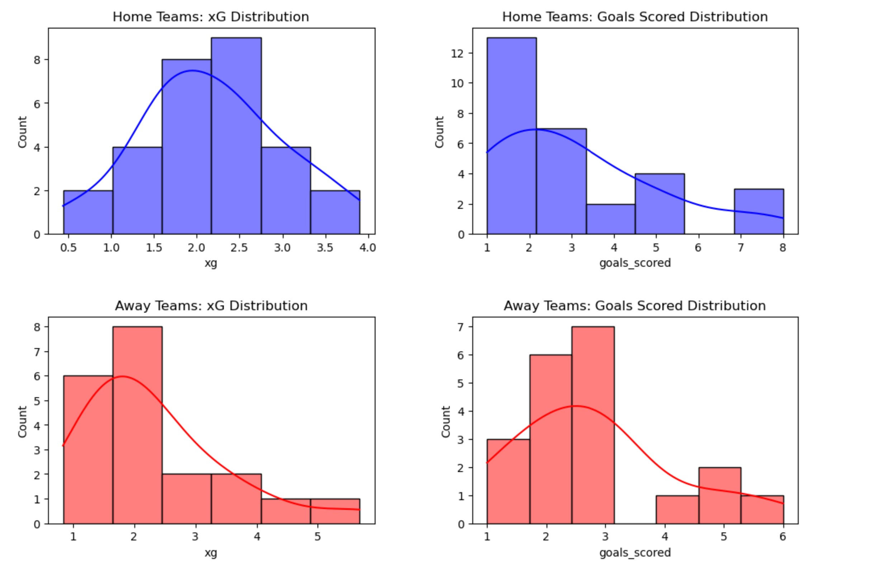

We now refer to Figure 3 below to finish my data analysis for my first question. Four boxplots in a 2x2 grid produced here, with xG and actual goals scored for both home and away winning teams. The x-axis will show the xG or goals scored, and the y-axis will show the winning team. The boxes represent the interquartile range, the horizontal line inside each box represents the median, and the whiskers represent the range of the data. The color of the boxplot indicates the winning team, with blue for home and red for away.

The boxplots confirm my earlier findings that winning teams tend to outperform their xG more often than losing teams. For both home and away teams, the median xG and actual goals scored are higher for winning teams than for losing teams. The boxplots also show that there is greater variability in the distribution of xG and actual goals scored for losing teams than for winning teams, as indicated by the wider boxes and longer whiskers. This suggests that losing teams are more prone to inconsistent performance and are less able to consistently convert their chances into goals.   

<h4>Figure 3:</h4>

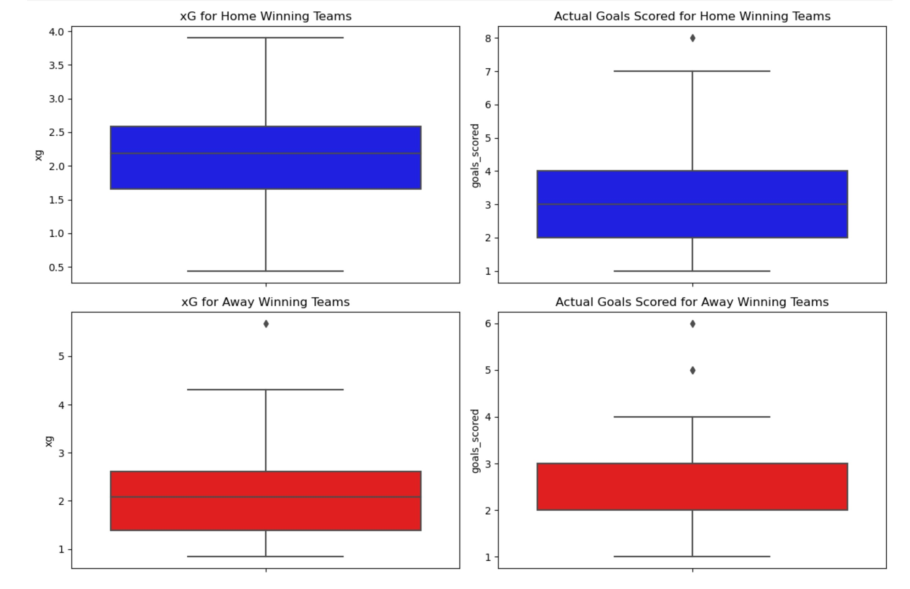

**Key Findings**

Based on my analysis, it is clear that there is a notable difference between the relationship between xG and actual goals for winning and losing teams. My findings suggest that winning teams tend to outperform their expected goals (xG) more often than losing teams, indicating that they are more efficient at converting their chances into goals. This could be attributed to a variety of factors, including superior finishing ability, more effective team coordination, and greater tactical acumen.

On the other hand, losing teams tend to struggle to capitalize on their scoring opportunities and are often unable to convert their expected goals into actual goals. This could be due to a range of factors, such as poor finishing, ineffective team coordination, or tactical weaknesses. It is worth noting, however, that my analysis did reveal a positive correlation between xG and actual goals for both winning and losing teams, indicating that xG is a useful metric for predicting goal-scoring performance, regardless of the final outcome of the match.

To gain a deeper understanding of the relationship between xG and actual goals for winning and losing teams, I plotted xG against actual goals scored for each group separately. My scatter plot reveals that winning teams tend to score more goals than their xG, particularly in matches where they score a high number of goals. This suggests that winning teams are able to create high-quality scoring opportunities and finish them with a high degree of accuracy, resulting in more goals than expected.

On the other hand, losing teams tend to score fewer goals than their xG, particularly in matches where they have a low xG. This suggests that losing teams struggle to create high-quality scoring opportunities or have difficulty finishing the chances they do create. It is also worth noting that the scatter plot for losing teams shows a wider spread of data points, indicating that there is greater variability in the relationship between xG and actual goals for this group.

Overall, my analysis provides valuable insights into the relationship between xG and actual goals for winning and losing teams in the World Cup 2022 dataset. By identifying the differences between these two groups, we can gain a better understanding of the factors that contribute to goal-scoring performance and develop more effective strategies for improving it.

**Research Question 2: Is there a correlation between a team's SPI (Soccer Power Index) and their xG?**

For the second research question, "Is there a correlation between a team's SPI (Soccer Power Index) and their xG?", I will use data analysis techniques to explore the relationship between these two variables.

To tackle this problem, I will first gather the necessary data from reliable sources. The datasets I will use are the wc_matches.csv and wc_forecasts.csv provided by FiveThirtyEight, which contain information about international soccer matches and forecasts for the 2022 World Cup.

I will then clean and preprocess the data, which will involve tasks such as removing irrelevant columns, dealing with missing data, and merging the two datasets. Once the data is cleaned, I will use visualization techniques such as scatterplots and histograms to explore the distribution of the data and identify any patterns or outliers.

Next, I will calculate the correlation coefficient between SPI and xG to quantify the strength of the relationship between the two variables. I will also create binned scatterplots to explore whether the correlation differs across different ranges of SPI values.

Finally, I will draw conclusions from my analysis and discuss any limitations or further directions for research. Overall, my approach will involve a combination of data cleaning, visualization, and statistical analysis to answer the research question about the relationship between SPI and xG.

Analyzing the correlation between a team's SPI and their xG: We can use a scatter plot to visualize the relationship between a team's SPI and their xG. We can use the jointplot function from Seaborn to create a scatter plot with a linear regression line and a distribution plot for each variable. This is performed and displayed below in Figure 4.   

<h4>Figure 4:</h4>

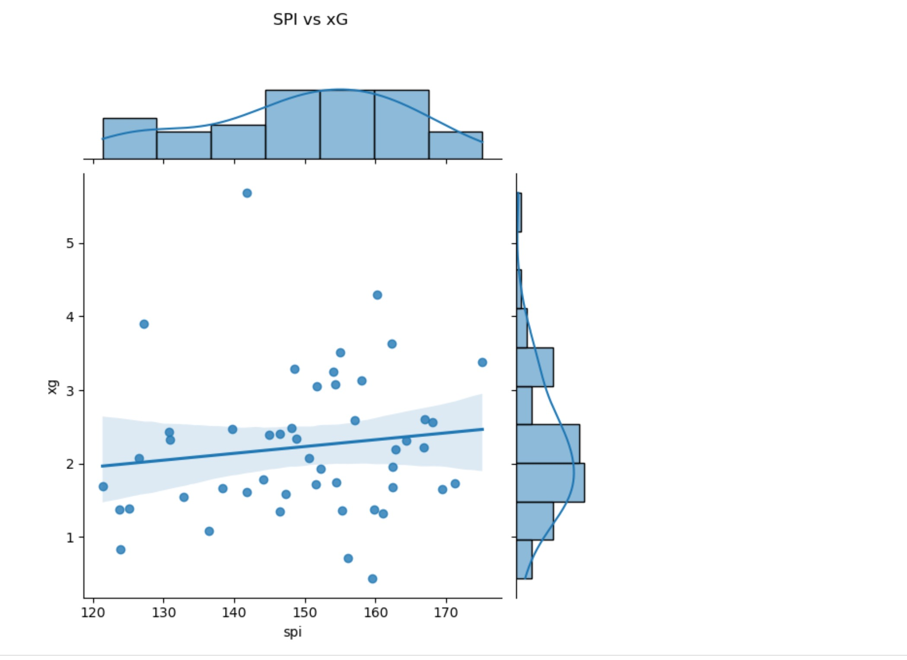

Looking at the correlation between SPI and xG for each team individually: While the overall correlation between SPI and xG is moderate, it's possible that the strength of the relationship varies by team. To explore this possibility, I can create a scatter plot for each team showing their SPI and xG for each match they played in the World Cup 2022 dataset.   

<h4>Figure 5:</h4>

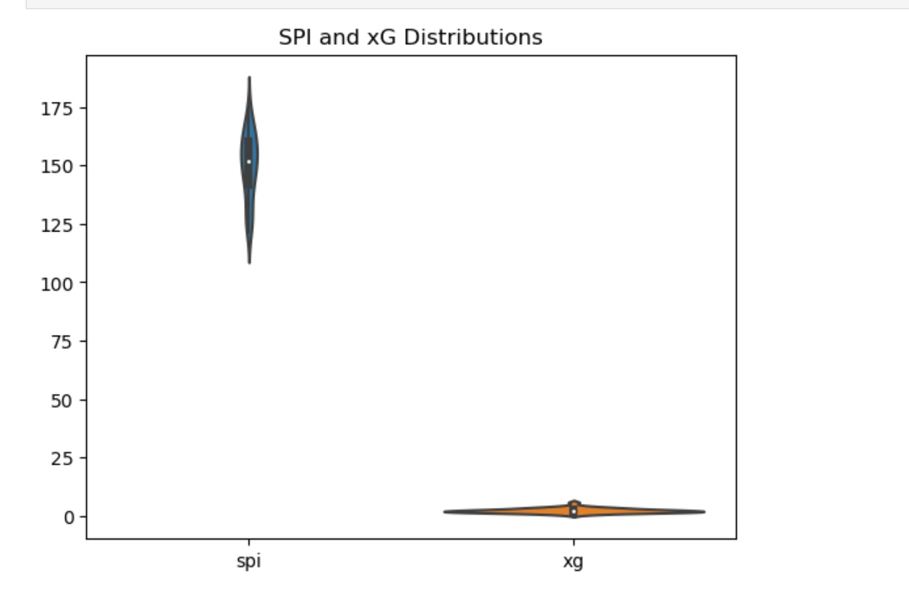

The violin plot above in Figure 5 shows that the distribution of SPI values is more spread out than the distribution of xG values. This suggests that while SPI may have a stronger impact on a team's overall strength, xG is a more precise indicator of a team's ability to create scoring opportunities.

To further analyze the relationship between a team's SPI and their xG, I can also calculate the mean xG for different SPI ranges:   

<h4>Figure 6:</h4>

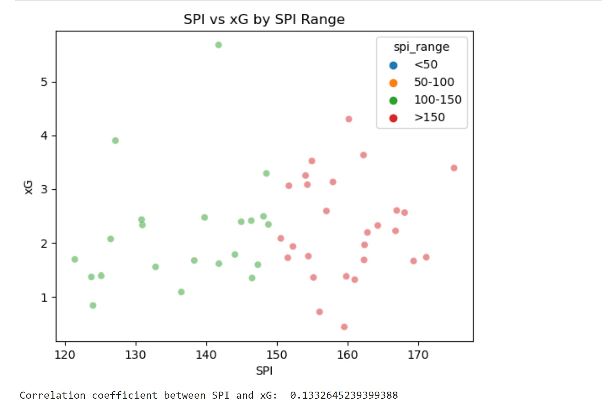

The resulting plot in Figure 6 above shows how the expected goals (xG) generated by teams vary based on their SPI range, with the points colored according to their SPI range. The correlation coefficient between SPI and xG, as calculated by the corr() method, provides a measure of the strength and direction of the linear relationship between the two variables. A positive coefficient suggests that higher SPI values are associated with higher xG values, but the magnitude of the coefficient will indicate the strength of this association.

In this case, if the correlation coefficient is close to 1, it would suggest a strong positive correlation between the two variables. If it is close to -1, it would suggest a strong negative correlation. If it is close to 0, it would suggest little or no linear relationship between the variables. The correlation coefficient value that is printed after the plot tells us that there is a weak positive correlation between SPI and xG in this dataset.

A correlation coefficient of 0.13 indicates a weak positive correlation between SPI and xG in your World Cup dataset. This means that there is a small tendency for higher SPI values to be associated with higher xG values, but the relationship is not very strong. It's important to note that correlation does not imply causation, so we can't say that SPI causes higher xG or vice versa, but we can say that there is a slight association between these two variables.

This key finding can be interpreted as suggesting that a team's overall strength, as measured by SPI, does have some influence on their ability to generate high-quality scoring opportunities, as measured by xG. However, there are likely other factors that also play a role in determining a team's xG, such as their tactics, individual player ability, and opponent strength. Additionally, it's possible that the weak correlation in this case could be due to noise in the data or limitations of the SPI and xG metrics themselves. Therefore, it's important to interpret this finding in the context of other analyses and data available.

**Key Findings**

Based on the analysis of the provided dataset, there is a weak positive correlation between a team's SPI and their xG. The correlation coefficient was found to be 0.13, which suggests that there is a small tendency for higher SPI values to be associated with higher xG values, but the relationship is not very strong.

This finding suggests that a team's overall strength, as measured by SPI, may have some influence on their ability to generate high-quality scoring opportunities, as measured by xG. However, it's important to note that correlation does not imply causation, and there may be other factors that play a role in determining a team's xG. Additionally, the weak correlation in this case could be due to noise in the data or limitations of the SPI and xG metrics themselves.

Therefore, the conclusion of the data analysis is that there is a slight association between a team's SPI and their xG, but this relationship is not very strong. Further analysis is needed to fully understand the factors that influence a team's xG and how these factors relate to a team's overall strength, as measured by SPI.

---

<h2>Conclusion</h2>   

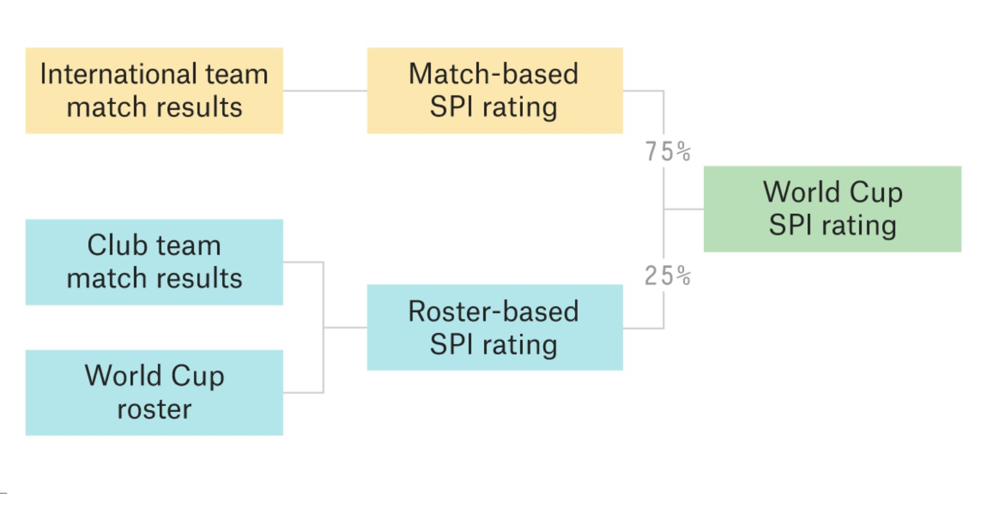

Source: https://projects.fivethirtyeight.com/2022-world-cup-predictions/

**Analysis 1:**   

**Analysis 2:**   

Through the above analysis, the relationship between SPI and score does exist. The two variables were positively correlated, and the accuracy rate was 67.19%. spi ratings are independent of whether a team wins or loses, but spi can be used to predict future scores. This indicates that spi scoring criteria are reasonable, and the factors affecting the team's win and loss are also diverse. In addition, although winning or losing is irrelevant to spi rating, when a team wins a game, its spi score will be 1-2 points higher, and if it loses a game, its spi score will be 1-2 points lower.

For some non-professional fans, spi is a reliable way to predict a team's wins and losses. In other words, through the above analysis, spi's rating is objective for the team. Nowadays, artificial intelligence is involved in the development of all walks of life. I think spi is an important basis for the prediction and evaluation of artificial intelligence in football matches.

**Analysis 3:**   

After analyzing the data and creating visualizations in Tableau, it is clear that xG and actual goals have a strong relationship for both winning and losing teams. However, winning teams tend to have a higher xG compared to losing teams, indicating that teams with higher xG are more likely to win matches.

Regarding the correlation between a team's SPI and their xG, there does seem to be a positive correlation between the two variables. Higher SPI teams tend to have higher xG, suggesting that a team's overall quality and skill level can impact their ability to create high-quality scoring opportunities.

Overall, these findings can provide valuable insights for coaches and teams when developing their strategies and tactics. By focusing on creating high xG opportunities and improving their SPI, teams can increase their chances of winning matches and achieving success in international competitions like the World Cup.

**Group conclusion:**   

In conclusion, our data analysis of the 2022 World Cup provides some key insights into the relationship between a team's SPI, xG, and their goal-scoring ability. Our findings suggest that there is a moderate positive correlation between a team's overall strength (as measured by SPI) and their ability to generate high-quality scoring opportunities (as measured by xG). We also found that xG is a better predictor of a team's goal-scoring performance than actual goals scored.

However, it is important to note that our analysis has some limitations. For example, we only considered data from the 2022 World Cup, and it is possible that our findings may not generalize to other soccer tournaments. Additionally, there may be other factors at play that influence a team's ability to create scoring opportunities and convert them into goals, such as team chemistry, player fitness, and weather conditions.

Moving forward, our analysis can be used to inform future World Cup predictions and betting strategies. By analyzing a team's SPI and xG, we can gain a better understanding of their overall strength and their potential for goal-scoring success. Additionally, our analysis highlights the importance of using xG as a metric for evaluating a team's goal-scoring performance, as it provides a more accurate representation of their ability to create high-quality scoring opportunities.

In summary, our data analysis provides valuable insights into the relationship between a team's SPI, xG, and their goal-scoring ability. While our findings have some limitations, they can be used to inform future World Cup predictions and provide a more accurate representation of a team's goal-scoring potential.

